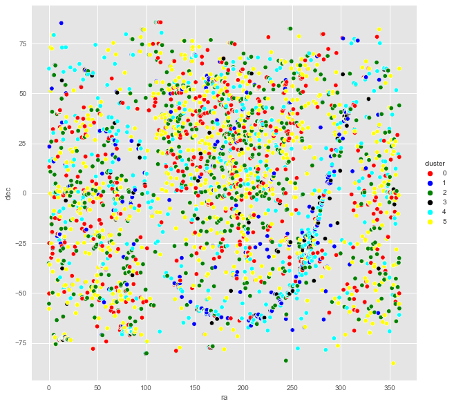

#  UNSUPERVISED MACHINE LEARNING FOR THE CLASSIFICATION OF ASTROPHYSICAL X-RAY SOURCES
---

#### _Víctor Samuel Pérez Díaz_ - Universidad del Rosario

#### _Advisor: Rafael Martínez-Galarza_ - Harvard-Smithsonian Center for Astrophysics

#### _Co-Advisor: Alexander Caicedo Dorado_ - Universidad del Rosario

---

---
## The Chandra Observatory

The Chandra X-ray Observatory is NASA’s flagship mission for X-ray astronomy. The telescope, launched to space in 1999 and currently still under operation, has been observing the X-ray sky with two instruments, the Advanced CCD Imaging Spectrometer (ACIS) and the High Resolution Camera (HRC). The two instruments register X-ray sources with unprecedented sensitivity and resolution in X-ray wavelengths. Among the most common targets of Chandra are X-ray binaries, accreting black holes in the center of galaxies, supernova remnants, and young, rapidly rotating magnetic stars. Over its 21 years of scientific life, Chandra has made some of the most remarkable discoveries in high-energy astrophysics. See https://chandra.harvard.edu/

---

## The Chandra Source Catalog

The Chandra Source Catalog (CSC) is the definitive catalog of X-ray sources detected by the Chandra X-ray Observatory. Version 2.0 (CSC2) is the second major release of the catalog, and represents a significant improvement with respect to version 1.1 in terms of sky coverage, sensitivity and capabilities. CSC2 includes measured properties for 317,167 unique compact and extended X-ray sources in the sky, allowing statistical analysis of large samples, as well as individual source studies. These properties include measurements of the source’s photometry (how bright they are), spectroscopy (what is the energy of the X-ray photons emitted), and variability (how do the flux and the spectrum of a source change over time). Extracted properties are provided for 928,280 individual observation detections identified in 10,382 Chandra ACIS and HRC-I imaging observations released publicly through the end of 2014. There are approximately 1,700 columns of tabular data with pertinent information about each source across 5 bands (broad, hard, medium, soft, and ultra-soft) for ACIS and 1 band (wide) for HRC, and 40 data products per source. The total size of the archive is close to 36 TB. See https://cxc.harvard.edu/csc/

---

# Machine learning classification

The CSC is a fertile ground for discovery, because many of the sources it contains have not been studied in detail. Among the potentially paradigm changing sources that we could look for in Chandra data are compact object mergers, extrasolar planet transits, tidal disruption events, etc. However, only a small fraction of the CSC sources have been classified, based either on their X-ray properties, or on the properties of their Al. In order to make a systematic study of the CSC sources that can lead to discoveries, we need to classify as many catalog sources as possible. The goal of this project is to do so, by employing unsupervised machine learning techniques. Unsupervised learning is more suitable for this task because of the lack of a large training set of X-ray sources. By associating specific groupings (clusters) of Chandra data with specific objects that have been previously classified spectroscopically, we hope to significantly enhance the number of sources for which a label is available. Some of the algorithms that are suitable for this task are (we will not usel all of them, but rather decide on the most suitable ones):

- Gaussian Mixtures
- Manifold models (t-SNE, UMAP)
- Clustering models (K-means, DBscan)
- Principal Component Analysis
- Neural Networks (Boltzmann machines)
- Self-organizing maps

The goal of the project is to apply one or several of these methods to the CSC dataset, in order to find the most likely classed for thousands of X-ray astrophysical sources.

---

# Specific goals

Among the specific goals of this project are:

- Get familiarized with the CSC dataset
- Cross-match the CSC with existing optical catalogs to provide a list of independently classified objects
- Feature selection: select those features of the CSC that are most relevant for classification
- Learn a model: apply an unsupervised approach to classification, and identified different types of X-ray sources.
- Association: associate the groupings resulting from the unsupervised models with sources that have been previously classified independently.
- Present a final list of likely classes for as many CSC sources as possible.

---

### References

- [**https://ui.adsabs.harvard.edu/abs/2019AAS...23345703R/abstract**](https://ui.adsabs.harvard.edu/abs/2019AAS...23345703R/abstract)
- [**https://arxiv.org/pdf/1509.03714.pdf**](https://arxiv.org/pdf/1509.03714.pdf)
- [**https://www.researchgate.net/publication/253230384_Comparison_of_Classification_Methods_for_XMM_Sources**](https://www.researchgate.net/publication/253230384_Comparison_of_Classification_Methods_for_XMM_Sources)
- [**https://iopscience.iop.org/article/10.1088/0004-637X/786/1/20**](https://iopscience.iop.org/article/10.1088/0004-637X/786/1/20)

