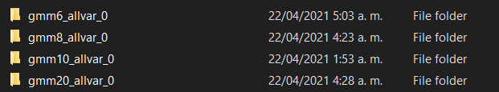
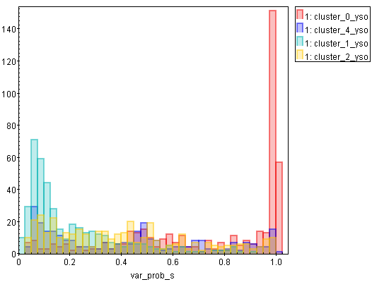
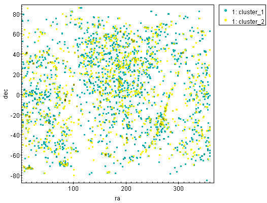
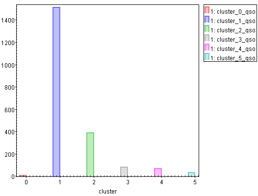
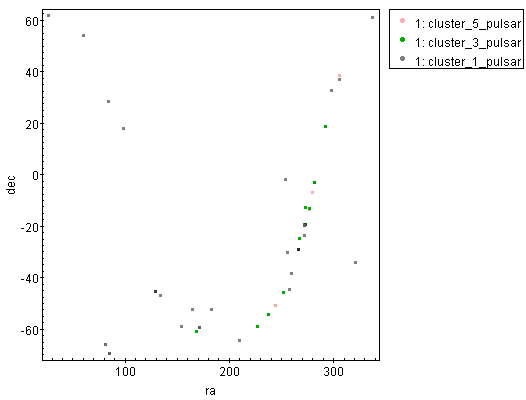
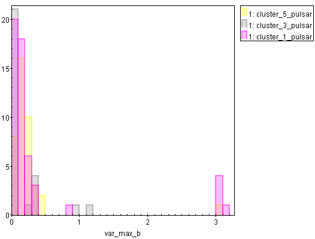

# Report

#### Víctor Samuel Pérez Díaz

---

The main objective for this week's work was to play a little bit with different implementations of Gaussian Mixture Models applied to our data. I performed four different clustering to our data, with 6, 8, 10 and 20 components respectively. Each analysis is labeled as follows:



For the analysis performed, as we have been doing for the last sessions, the following descriptors were considered:

```
'theta', 'src_area_b', 'hard_hm', 'hard_hs', 'hard_ms', 'powlaw_gamma', 'bb_kt', 'var_prob_b','var_sigma_b', 'var_mean_b', 'var_min_b', 'var_max_b', 'var_prob_h', 'var_sigma_h', 'var_mean_h', 'var_min_h', 'var_max_h', 'var_prob_m', 'var_sigma_m', 'var_mean_m', 'var_min_m', 'var_max_m', 'var_prob_s', 'var_sigma_s',
'var_mean_s', 'var_min_s', 'var_max_s', 'ks_prob_b', 'ks_prob_h', 'ks_prob_m', 'ks_prob_s', 'kp_prob_b', 'kp_prob_h', 'kp_prob_m', 'kp_prob_s'
```

Additionally, the following descriptors were log transformed and then normalized:

```
'theta', 'src_area_b', 'bb_kt', 'var_sigma_b', 'var_mean_b', 'var_min_b', 'var_max_b', 'var_sigma_h', 'var_mean_h', 'var_min_h', 'var_max_h', 'var_sigma_m', 'var_mean_m', 'var_min_m', 'var_max_m',  'var_sigma_s', 'var_mean_s', 'var_min_s', 'var_max_s'
```

And finally, a normalization was performed to the descriptor `'powlaw_gamma'` (had some negative values).

With the data at hand already adequate and dropping NaNs, there is a final input data of $23025$ observations, that later fed our different models.

For our final data output, the probabilities of belonging to each cluster were added for each sample.

## Simbad queries

---

Thanks to the holy TOPCAT tool, it was possible to perform a clean crossmatch between the different clustering results and the SIMBAD database. In this particular case, a `each` crossmatch type was performed: Load a new table with the same number of rows as the local table, in the same order. The best remote match, if any, appears alongside the local row, but if there is no match the remote columns are blank.

Hence, we have an output with the same observations as our initial data, but with the information of the corresponding "best" object in SIMBAD in case of being found. 

For making this report brief and illustrative, I am going to focus in the $6$ components case. Our crossmatch result can be found as `gmm6_allvar_0/queries/gmm6_allvar_0_simbad.csv`. 

We perform a queries for each cluster, sorting descending by the count of samples grouped in a particular main_type. For the observations that were not found in SIMBAD, a 'NaN' label was assigned:

**cluster_0:**

| main_type     |   ('prob_0', 'mean') |   ('prob_1', 'mean') |   ('prob_2', 'mean') |   ('prob_3', 'mean') |   ('prob_4', 'mean') |   ('prob_5', 'mean') |   size |
|:--------------|---------------------:|---------------------:|---------------------:|---------------------:|---------------------:|---------------------:|-------:|
| Orion_V*      |             0.997347 |         5.57946e-173 |          0.00083091  |         5.18361e-112 |          0.00182242  |          1.60794e-10 |    495 |
| YSO           |             0.99872  |         1.03102e-182 |          0.00106179  |         2.52456e-113 |          0.000218404 |          2.30812e-07 |    418 |
| Star          |             0.999105 |         3.18594e-176 |          0.000382979 |         5.36678e-102 |          0.000512346 |          7.14997e-13 |    298 |
| NaN           |             0.99841  |         5.67276e-175 |          0.00124898  |         2.19344e-107 |          0.000340597 |          1.26035e-09 |    274 |
| TTau*         |             0.999787 |         8.0982e-180  |          0.000211686 |         5.18825e-114 |          1.13834e-06 |          3.84138e-13 |    103 |
| X             |             0.999999 |         4.56248e-188 |          1.02578e-07 |         1.73584e-117 |          2.84504e-07 |          1.43133e-07 |     82 |
| BYDra         |             0.998821 |         1.16334e-188 |          0.00116358  |         6.43828e-129 |          1.51943e-05 |          1.16596e-18 |     45 |
| Candidate_YSO |             1        |         1.86216e-229 |          2.41296e-12 |         5.02525e-153 |          8.22898e-12 |          6.81901e-29 |     44 |
| HMXB          |             0.996395 |         2.56926e-191 |          0.00352362  |         4.2981e-108  |          1.8699e-07  |          8.13893e-05 |     33 |
| PM*           |             0.999999 |         5.75039e-213 |          1.51046e-26 |         1.52181e-157 |          7.16076e-07 |          9.10667e-23 |     18 |


**cluster_1:**

| main_type     |   ('prob_0', 'mean') |   ('prob_1', 'mean') |   ('prob_2', 'mean') |   ('prob_3', 'mean') |   ('prob_4', 'mean') |   ('prob_5', 'mean') |   size |
|:--------------|---------------------:|---------------------:|---------------------:|---------------------:|---------------------:|---------------------:|-------:|
| NaN           |                    0 |             0.989716 |           0.00455037 |           0.00454984 |          0.00049578  |          0.000687658 |   3545 |
| QSO           |                    0 |             0.991985 |           0.00494988 |           0.00245447 |          0.000151794 |          0.000458896 |   1494 |
| X             |                    0 |             0.986269 |           0.0035397  |           0.00935563 |          0.000467017 |          0.000368292 |   1476 |
| Star          |                    0 |             0.990024 |           0.00306435 |           0.00220558 |          0.00356424  |          0.00114214  |    709 |
| YSO           |                    0 |             0.990998 |           0.00353102 |           0.00268854 |          0.00274593  |          3.66617e-05 |    393 |
| Orion_V*      |                    0 |             0.988406 |           0.00507895 |           0.00338818 |          0.00239945  |          0.000727535 |    363 |
| AGN           |                    0 |             0.990935 |           0.00638511 |           0.00153323 |          0.000206151 |          0.000940639 |    353 |
| Candidate_XB* |                    0 |             0.992997 |           0.00318264 |           0.00325997 |          4.96258e-05 |          0.000510776 |    346 |
| Seyfert_1     |                    0 |             0.988501 |           0.00888869 |           0.00155835 |          9.74473e-06 |          0.00104267  |    309 |
| GlCl          |                    0 |             0.992882 |           0.00213877 |           0.00468869 |          0.000221735 |          6.92495e-05 |    270 |


**cluster_2:**

| main_type   |   ('prob_0', 'mean') |   ('prob_1', 'mean') |   ('prob_2', 'mean') |   ('prob_3', 'mean') |   ('prob_4', 'mean') |   ('prob_5', 'mean') |   size |
|:------------|---------------------:|---------------------:|---------------------:|---------------------:|---------------------:|---------------------:|-------:|
| NaN         |          5.17687e-05 |           0.0122975  |             0.976524 |          0.00554065  |           0.00553394 |          5.17211e-05 |   1129 |
| X           |          8.31363e-63 |           0.0135902  |             0.976558 |          0.00480061  |           0.0048923  |          0.000158775 |    401 |
| QSO         |          6.37605e-49 |           0.0154078  |             0.976107 |          0.00364897  |           0.00481223 |          2.43368e-05 |    379 |
| YSO         |          0.00117504  |           0.00647163 |             0.976985 |          0.00209331  |           0.0120614  |          0.00121324  |    358 |
| Orion_V*    |          2.67581e-06 |           0.0103989  |             0.974338 |          0.00146378  |           0.0137904  |          6.49878e-06 |    347 |
| Star        |          0.000147378 |           0.00346836 |             0.985926 |          0.00403307  |           0.00581678 |          0.000608393 |    243 |
| AGN         |          3.7601e-13  |           0.00833681 |             0.975393 |          0.00606409  |           0.0101356  |          7.09126e-05 |    147 |
| HMXB        |          2.93552e-10 |           0.00812522 |             0.969396 |          0.00965512  |           0.0124888  |          0.000334672 |    132 |
| Seyfert_1   |          2.79666e-27 |           0.0070518  |             0.981593 |          0.00521201  |           0.00571146 |          0.000432162 |    102 |
| TTau*       |          4.0993e-06  |           0.00191807 |             0.981961 |          2.46995e-07 |           0.0160773  |          3.9521e-05  |     78 |


**cluster_3:**
| main_type   |   ('prob_0', 'mean') |   ('prob_1', 'mean') |   ('prob_2', 'mean') |   ('prob_3', 'mean') |   ('prob_4', 'mean') |   ('prob_5', 'mean') |   size |
|:------------|---------------------:|---------------------:|---------------------:|---------------------:|---------------------:|---------------------:|-------:|
| NaN         |                    0 |           0.0431748  |          0.0111607   |             0.94324  |          0.00106035  |          0.00136379  |    443 |
| X           |                    0 |           0.0286041  |          0.00928203  |             0.958181 |          0.000800442 |          0.00313253  |    288 |
| HMXB        |                    0 |           0.0205474  |          0.0037691   |             0.974924 |          0.000494412 |          0.000264806 |    167 |
| YSO         |                    0 |           0.0234976  |          0.00950804  |             0.964695 |          0.000463267 |          0.00183589  |    125 |
| Star        |                    0 |           0.0172103  |          0.00286334  |             0.978048 |          0.00150422  |          0.000374263 |     92 |
| QSO         |                    0 |           0.016975   |          0.0289005   |             0.953877 |          0.000161957 |          8.50755e-05 |     77 |
| SNR         |                    0 |           0.00133082 |          9.98279e-06 |             0.992565 |          6.32901e-13 |          0.00609412  |     54 |
| Orion_V*    |                    0 |           0.0238839  |          0.0109175   |             0.957044 |          8.97498e-06 |          0.00814612  |     47 |
| AGN         |                    0 |           0.0192553  |          0.00473738  |             0.968457 |          0.00753324  |          1.69934e-05 |     47 |
| GlCl        |                    0 |           0.0282075  |          0.00179505  |             0.95941  |          8.19481e-05 |          0.0105054   |     45 |


**cluster_4:**
| main_type   |   ('prob_0', 'mean') |   ('prob_1', 'mean') |   ('prob_2', 'mean') |   ('prob_3', 'mean') |   ('prob_4', 'mean') |   ('prob_5', 'mean') |   size |
|:------------|---------------------:|---------------------:|---------------------:|---------------------:|---------------------:|---------------------:|-------:|
| NaN         |         8.77639e-09  |          0.00336114  |          0.0166633   |          0.001404    |             0.976868 |          0.00170358  |    410 |
| Star        |         0.00101805   |          0.00356529  |          0.00564275  |          0.000517287 |             0.984523 |          0.00473361  |    256 |
| YSO         |         0.00148902   |          0.0022905   |          0.0216257   |          0.00120729  |             0.969471 |          0.00391644  |    254 |
| Orion_V*    |         2.56591e-05  |          0.000725703 |          0.0228132   |          9.16586e-12 |             0.971339 |          0.00509608  |    197 |
| X           |         0.000216096  |          0.000946864 |          0.0108824   |          0.00373472  |             0.980694 |          0.00352578  |    164 |
| TTau*       |         0.00425837   |          0.0205668   |          0.011929    |          1.34285e-08 |             0.962906 |          0.000339396 |    102 |
| HMXB        |         1.97612e-09  |          0.00104921  |          0.00609416  |          2.20894e-06 |             0.992419 |          0.000435133 |     78 |
| QSO         |         2.11425e-09  |          0.0102511   |          0.0244562   |          4.58292e-05 |             0.960349 |          0.00489798  |     70 |
| PM*         |         3.52584e-05  |          1.52838e-06 |          1.84932e-14 |          1.60031e-31 |             0.999924 |          3.91053e-05 |     57 |
| GlCl        |         6.22381e-165 |          6.42862e-08 |          3.22204e-05 |          9.04779e-91 |             0.999086 |          0.000881717 |     54 |


**cluster_5:**
| main_type   |   ('prob_0', 'mean') |   ('prob_1', 'mean') |   ('prob_2', 'mean') |   ('prob_3', 'mean') |   ('prob_4', 'mean') |   ('prob_5', 'mean') |   size |
|:------------|---------------------:|---------------------:|---------------------:|---------------------:|---------------------:|---------------------:|-------:|
| NaN         |          1.33318e-08 |          0.00785709  |          0.000792446 |          0.000753696 |          0.00676762  |             0.983829 |    124 |
| Seyfert_2   |          0           |          0.000811287 |          2.29474e-09 |          0.00155779  |          0.000417816 |             0.997213 |     98 |
| X           |          1.78954e-51 |          0.00297067  |          0.00113085  |          0.00225342  |          0.0133037   |             0.980341 |     89 |
| PartofG     |          8.17489e-35 |          0.0182511   |          0.000143433 |          8.02659e-08 |          5.01751e-09 |             0.981605 |     45 |
| Pulsar      |          0           |          0.0120947   |          1.86643e-13 |          0.0084717   |          1.32732e-07 |             0.979433 |     40 |
| Radio       |          1.20146e-07 |          0.000376879 |          1.28596e-08 |          1.11175e-08 |          0.00249376  |             0.997129 |     40 |
| YSO         |          6.39935e-13 |          0.00120053  |          0.000313914 |          0.0025011   |          0.0135169   |             0.982468 |     39 |
| QSO         |          0           |          0.000515639 |          0.000737884 |          0.000712826 |          0.00981734  |             0.988216 |     35 |
| HMXB        |          4.18853e-09 |          6.99769e-05 |          9.69238e-08 |          0.000506612 |          0.000329115 |             0.999094 |     35 |
| Star        |          3.61605e-31 |          0.0046002   |          4.8865e-05  |          0.00128977  |          0.013364    |             0.980697 |     33 |

I attached a notebook in each `queries` folder in order to be able to see this tables for each model performed.

Now, for this case, we can explore some differences in the clusters looking at their predominant `main_type`. Let's see some of these features:

## Exploring YSOs

---

- It can be seen that one of the most predominant type is YSO or related, such as Orion_V* or TTau*. It can be seen as well that there is no just one cluster with a good amount of YSOs, but we could explore what differences in these kind of object are being identified by our clustering:

  **Samples labeled as `Orion_V*`, `YSO - Candidate_YSO`, `TTau*` in the data:**


We can see some clusters with predominant YSO type, these types of objects are predominant in the galactic plane:


It is clear that some regions of the galactic plane are being well defined by these clusters. Specifically, these regions are particularly matching most of the Young Stellar Objects in the initial plot. Nevertheless, these clusters don't accomplish covering all the YSOs.

- Plot of the amount of YSO and Candidate_YSO in each cluster:

  

It is clear that the most predominant clusters in this kind of objects are 0,1,2, and 4.

Now differences in their features can be explored:

- var_prob_s for the YSO and Candidate_YSO in clusters 0, 1, 2, and 4:



Now it can be seen that our clustering is separating, in this case, some YSOs with very high variability (0) and very low variability (1) in the soft band. 

- hard_hs for the YSO and Candidate_YSO in clusters 3, 4 and 5:

  

Now we can find hints in the separation of the less predominant clusters with YSOs, for example, in this case we find a good separation between the cluster 4 with a high presence in the soft band, and in the other clusters, having a trend in the hard band. For the other clusters not appearing in this plot, a 'more' normal distribution can be found, with their means trending to 0.

The YSOs encountered in these clusters are mostly in the galactic plane:


## Exploring QSOs

---


- For the cluster 1 and 2, we can see `QSO` as a predominant object. We can see that the `QSO` tends to be an extragalactic object:

  

And even though cluster 1 and 2 represents objects in the galactic plane, we can see that these are most defined as extragalactic, and matches with a lot of quasars.



For this case we can see a clear predominance in clusters 1 and 2:



We can see a pattern in the hardness ratios, that could be a particular feature of QSO:


And it seems that the descriptor that defines the separation is the ks test probability:


We can see too that the QSOs encountered in the clusters 1 and 2 define a good proportion of the extra galactic objects:


## Exploring Pulsars and Seyfert_2 galaxies

---

- Seyfert_2 galaxies tend to be described by clusters 5 and 1:

  

While the difference between one and other may be the trend in the hardness ratios:


In the pulsar case, we can find them frequently in clusters 1, 3 and 5:



It is clear that pulsars trend to be in the galactic plane. We can see some differences in the hardness ratios:


While in variability the trends goes in the same direction:



# Some remarks about the different clustering models performed

---

- It seems that the probability is not giving us great hints in the case of GMM. As we can see, the probability tends to be greater than 98% for the respective cluster of an specific table view, and for the other cases it is negligible. We could try other measures, like going back to silhouette score (but now performed in the GMM model), or exploring alternatives present in sklearn methods, like `score_samples` in ([sklearn.mixture.GaussianMixture — scikit-learn 0.24.1 documentation](https://scikit-learn.org/stable/modules/generated/sklearn.mixture.GaussianMixture.html#sklearn.mixture.GaussianMixture.score_samples)).
- We can continue exploring the results for the different clusterings in a similar way that we did here, some are not very much explored. For example, the extreme case of 20 components seems like an interesting place to look at!
- I attach all the cross-matched data here, with a little notebook for exploring the objects in each cluster for each case.

# Some thoughts

---

- It seems that the clustering models are grouping different kind of same-type objects. For example, we can find softer YSOs in some clusters and harder YSOs in others.
- What if we see the clusters in a feature oriented way, instead of looking an specific type of object in each cluster? For example, if we want to find softer objects, with an specific type, we could query one of these clusters.